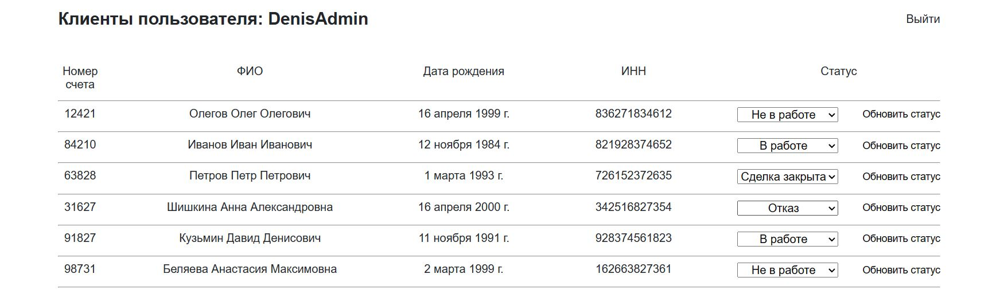

# Тестовое задание на позицию стажера Fullstack-разработчика
1. Синтезировать данные для базы данных:

* Таблица клиентов
    + Номер счета
    + Фамилия
    + Имя
    + Отчество
    + Дата рождения
    + ИНН
    + ФИО ответственного
    + Статус (по умолчанию «Не в работе»)

* Таблица пользователей
    + ФИО
    + Логин
    + Пароль

2. Создать интерфейс для обращения к синтезированным данным:
* Форма для авторизации по паре логин/пароль
* После показать таблицу клиентов авторизованного
пользователя по связи ФИО из таблицы пользователей – ФИО
ответственного
* Пользователь должен иметь возможность изменить статус
клиента на «В работе», «Отказ», «Сделка закрыта»

## Содержание
- [Тестовое задание на позицию стажера Fullstack-разработчика](#тестовое-задание-на-позицию-стажера-fullstack-разработчика)
  - [Содержание](#содержание)
  - [Скриншоты проекта](#скриншоты-проекта)
  - [Технологии](#технологии)
  - [Установка и использование](#установка-и-использование)
    - [Подготовка](#подготовка)
    - [Работа с базой данных](#работа-с-базой-данных)
    - [Работа с приложением](#работа-с-приложением)
  - [Возможности проекта](#возможности-проекта)
  - [Команда проекта](#команда-проекта)


## Скриншоты проекта
> [!WARNING]
Все совпадения с реальными людьми случайны!

Главная страница



## Технологии
- [django](https://www.djangoproject.com/)
- [HTML](https://html.com/)
- [CSS](https://www.w3.org/Style/CSS/Overview.en.html)

## Установка и использование

### Подготовка
Установка виртуального окружения:
```bash
$ python3 -m venv venv
```

Включение виртуального окружения:
```bash
$ source venv/bin/activate
```

Установка зависимостей:
```bash
$ pip install -r requirements.txt 
```

### Работа с базой данных

Обнаружение изменений:
```bash
$ python manage.py makemigrations
```

Проведение миграций:
```bash
$ python manage.py migrate
```

Загрузка тестовых данных:
```bash
$ python manage.py loaddata data.json
```

### Работа с приложением

Запуск тестового сервера
```bash
$ python manage.py runserver
```

Авторизация как администратор:
* Логин - UserAdmin
* Пароль - 123


## Возможности проекта
- [x] Авторизоваться
- [x] Регистрироваться
- [x] Менять статус клиента


## Команда проекта

- [Копылов Денис](https://t.me/TimeToBeShine) — Fullstack-разработчик
